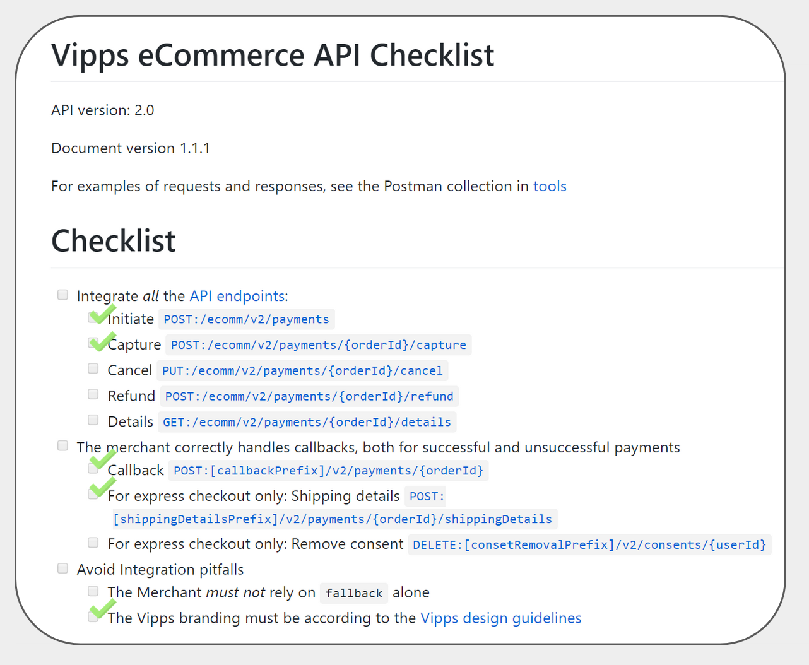
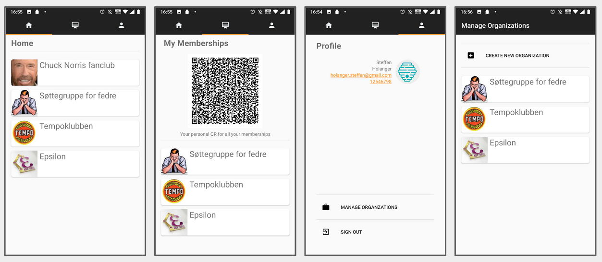
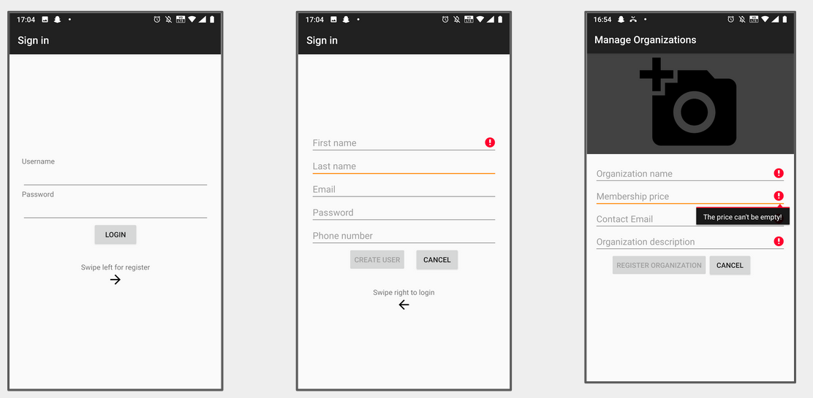

# KLUBBHUSET
IE303911-Mobile-og-Distribuerte Applikasjoner Prosjektoppgave

Distribuert løsning for medlemsskap i klubber og organisasjoner

Det vi har oppnådd i dette prosjektet er å lage et system hvor organisasjoner og brukere kan holde styr på hverandre. Man har ofte medlemskap i mange forskjellige klubber/organisasjoner eller man som organisasjon har mange medlemmer, så trenger man et system for å håndtere alle disse medlemskapene. Det har vi løst ved å introdusere enkle menyer for å se gjennom sine medlemskap eller opprette nye, samtidig er det mulig for en organisasjon å autentisere medlemskap ved hjelp av medlems personlige QR-kode og organisasjons QR-scanner. En annen stor funksjon som er integrert på et "test-nivå" se figur 1, er en betalingsløsning som sender deg til vipps-appen med korrekt beløp for medlemskontigent og organisasjon.

Figur 1






## Reqiuired Local Files:
create this file
.\app\src\main\assets\connection.properties

and add the following fields with your own values
host=[address]
port=[portnumber]


## Docker log from server

Log on to the server with ssh

Run following command: 

```bash
docker-compose -f /home/stefhola/klubbhuset/server/docker-compose.yml logs --follow
```

This will show log from all the services. `Ctrl+C` to quit

If you just want to log the one service you can specify it at the end of the command.
